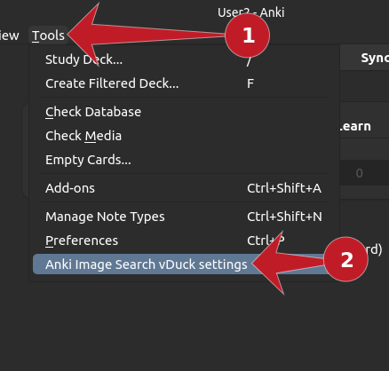
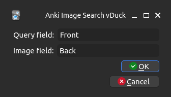
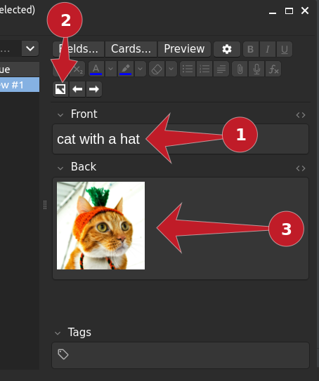

# Anki Image Search vDuck Addon
Retrieves images using https://duckduckgo.com/ and inserts them into the card.

This only works for Anki 2.1.54+

Forked from https://github.com/nerevar/anki_image_search_v2

## How to use
Once the addon has been installed you will need to configure the fields that you want to use for the image search and the field you want the image to go in to.

Click on tools -> Add-ons -> Anki Image Search vDuck settings

Enter the fields you want to use for a search term (Query Field) and the field you want the image to go in to. Shown below. (Note these will be different for your cards)

Then when you are creating a card you can click on the image search button, it will search for images and insert them into the field you specified.

You can track the project on [github](https://github.com/kit-nya/anki_image_search_vduck/).
If you find any bugs, please open an issue on github.
## License

The icons are provided by [Open Iconic](https://useiconic.com/open). Open Iconic is licensed under MIT.

This project is licensed is under [GPLv2](./LICENSE).

This project relies on and is bundled with [duckduckgo-search](https://pypi.org/project/duckduckgo-search/) which is provided under an MIT license.

## Why
I don't like Yandex. Gotta show Ukrainians some love.